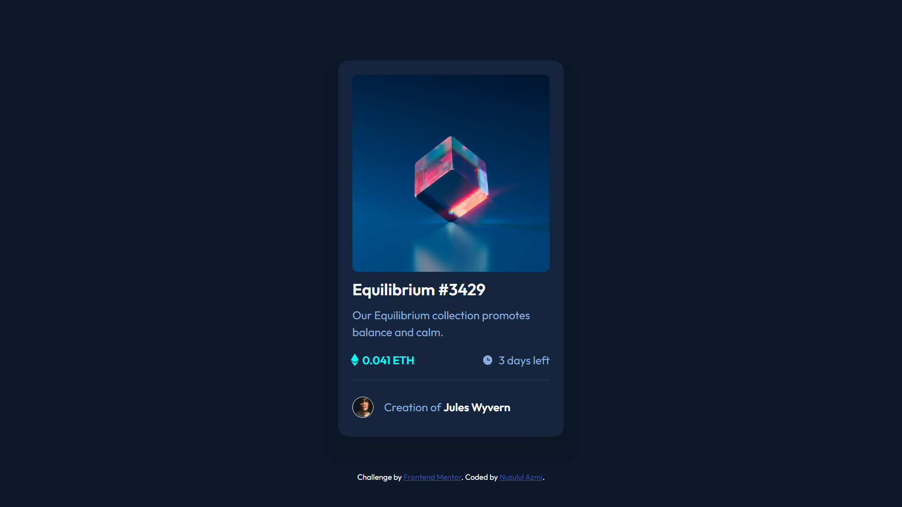

# Frontend Mentor - NFT preview card component solution

This is a solution to the [NFT preview card component challenge on Frontend Mentor](https://www.frontendmentor.io/challenges/nft-preview-card-component-SbdUL_w0U). Frontend Mentor challenges help you improve your coding skills by building realistic projects. 

## Table of contents

- [Overview](#overview)
  - [The challenge](#the-challenge)
  - [Screenshot](#screenshot)
  - [Links](#links)
- [My process](#my-process)
  - [Built with](#built-with)
- [Author](#author)
- [Acknowledgments](#acknowledgments)

## Overview

### The challenge

Users should be able to:

- View the optimal layout depending on their device's screen size
- See hover states for interactive elements

### Screenshot

### Links

- Solution URL: [View solution](https://www.frontendmentor.io/solutions/responsive-nft-card-using-flexbox-and-media-queries-BybCQv3Qhj)
- Live Site URL: [View Site](https://nuzulazmi.github.io/nft-preview-card/)

## My process

### Built with

- Semantic HTML5 markup
- CSS custom properties
- Flexbox
- Mobile-first workflow
- Media queries

## Author

- Website -  - 
- Frontend Mentor - [@nuzulazmi](https://www.frontendmentor.io/profile/nuzulazmi)
- Twitter - [Nuzulul Azmi](https://twitter.com/Nuzuelazmy)
- LinkedIn - [Nuzulul Azmi](https://www.linkedin.com/in/nuzuel-azmy-392490246/)
- Github - [Nuzulul Azmi](https://github.com/nuzulazmi)
- W3Schools - [Nuzulul Azmi](https://www.w3profile.com/Nuzulul_Azmi)
- StackOverflow - [nuzulul-azmi](https://stackoverflow.com/users/20308624/nuzulul-azmi)
- FreeCodeCamp - [Nuzulul Azmi](https://www.freecodecamp.org/fccb299c7c7-1716-4665-9d41-3b6ea74a4eed)

## Acknowledgments

-
